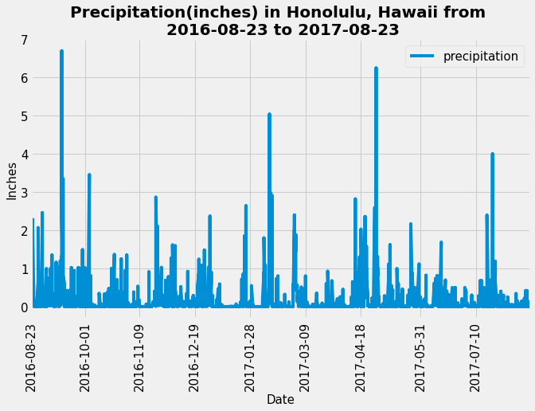
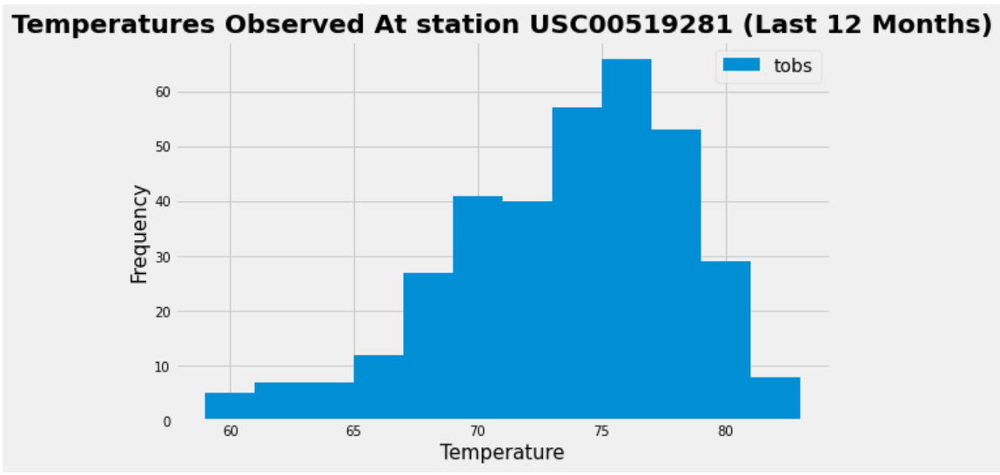

# Unit 10 Homework: Surf’s Up

## Instructions

Congratulations! You've decided to treat yourself to a long holiday vacation in Honolulu, Hawaii! To help with your trip planning, you need to do some climate analysis on the area. The following sections outline the steps you must take to accomplish this task.

### Part 1: Climate Analysis and Exploration

* Please refer to [starter notebook](climate_starter.ipynb) and [hawaii.sqlite](Resources/hawaii.sqlite) files for climate analysis and data exploration containing the following:

    * SQLAlchemy’s `create_engine` to connect to your SQLite database.

    * SQLAlchemy’s `automap_base()` to reflect your tables into classes and save a reference to those classes called `Station` and `Measurement`.

    * Link Python to the database by creating a SQLAlchemy session.

#### Precipitation Analysis

Analysis of precipitation in the area:

* Plot the results by using the DataFrame `plot` method, as shown in the following image:

* Use Pandas to print the summary statistics for the precipitation data.

#### Station Analysis

    * Plot the results as a histogram with `bins=12`, as shown in the following image:

### Part 2: Design Your Climate App

Please refer to app.py for Flask API based on the queries that I have just developed.

Use Flask to create your routes, as follows:

* `/`

    * Homepage.

    * List all available routes.

* `/api/v1.0/precipitation`

    * Convert the query results to a dictionary using `date` as the key and `prcp` as the value.

    * Return the JSON representation of your dictionary.

* `/api/v1.0/stations`

    * Return a JSON list of stations from the dataset.

* `/api/v1.0/tobs`

    * Query the dates and temperature observations of the most active station for the previous year of data.

    * Return a JSON list of temperature observations (TOBS) for the previous year.

* `/api/v1.0/<start>` and `/api/v1.0/<start>/<end>`

    * Return a JSON list of the minimum temperature, the average temperature, and the maximum temperature for a given start or start-end range.

    * When given the start only, calculate `TMIN`, `TAVG`, and `TMAX` for all dates greater than or equal to the start date.

    * When given the start and the end date, calculate the `TMIN`, `TAVG`, and `TMAX` for dates from the start date through the end date (inclusive).

## Hints

* You will need to join the station and measurement tables for some of the queries.

* Use Flask `jsonify` to convert your API data into a valid JSON response object.

## Rubric

[Unit 10 Homework Rubric](https://docs.google.com/document/d/1gT29iMF3avSvJruKpcHY4qovP5QitgXePqtjC6XESI0/edit?usp=sharing)

- - -

## References

Menne, M.J., I. Durre, R.S. Vose, B.E. Gleason, and T.G. Houston, 2012: An overview of the Global Historical Climatology Network-Daily Database. Journal of Atmospheric and Oceanic Technology, 29, 897-910, [https://doi.org/10.1175/JTECH-D-11-00103.1](https://doi.org/10.1175/JTECH-D-11-00103.1)

- - -

© 2022 Trilogy Education Services, a 2U, Inc. brand. All Rights Reserved.
